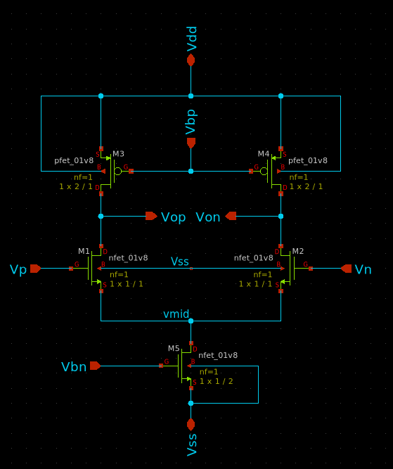
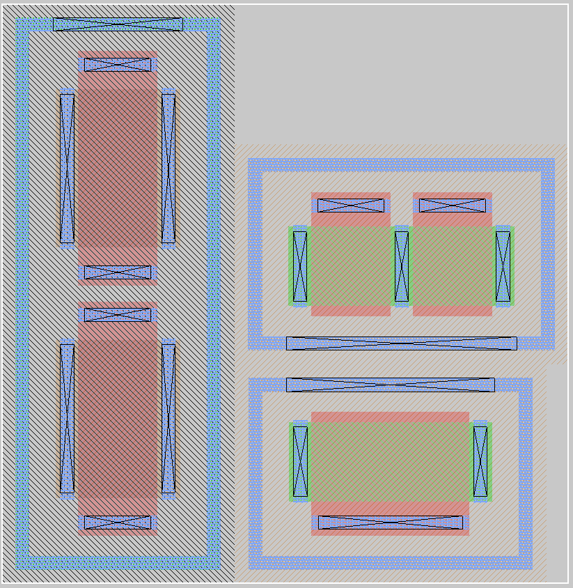
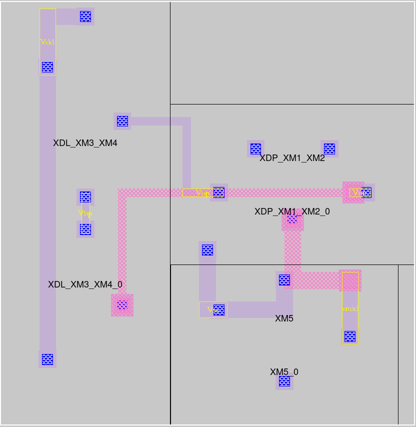

# RALF - Reinforcement Learning assisted Automated analog Layout design Flow

As part of a master's thesis, at the Institute for Integrated Circuits (IIC), Johannes Kepler University, Linz, Austria,
an automated analog layout design flow was developed.

<p align="center">
    
<p/>

The input of the flow is a netlist in the SPICE format composed of devices using the SkyWater Technologies SKY130 process design kit. Optionally, a file in the json-format that contains information for the routing task, like minimum wire widths, can also be specified. From the netlist, the circuit is captured and converted into an internal data structure, that is capable for the tasks of the remaining flow. The subsequent stage annotates devices which are forming smaller circuits and match those in a precompiled database. Thus, these precompiled circuits allow the finding of differential pairs, differential loads, cross-coupled pairs, and in series connected resistors, so called R-strings. 
From the annotated circuit, the primitive cells are instantiated, by the use of the parametrized cell generator available in [MAGIC](https://github.com/RTimothyEdwards/magic). The positions of the cells in the layout are then found by using a reinforcement learning algorithm (or optionally by using a simulated annealing algorithm), such that they minimize a cost function based on the estimated total wire length and routing congestion. After the placement is fixed, a two stage routing-algorithm connects the devices. 
The first stage is a wire-planning algorithm which plans the routes on a rough tile-based grid and provides a guidance to the second stage, which is a detailed router. That one lays out the actual resources by using a gridless approach based on obstacle expansion. The output of the whole flow is a .mag-file which contains the placement, and a Tcl script for generating the routing in [MAGIC](https://github.com/RTimothyEdwards/magic).

## Getting started
### Step 0: Prerequisites (Recommended)
- Use the [IIC-OSIC-TOOLS](https://github.com/iic-jku/IIC-OSIC-TOOLS) all in one docker container.

### Step 0.1: Prerequisites (Optional)
- [SKY130 PDK](https://github.com/google/skywater-pdk)
    - For easy installation checkout [volare](https://github.com/efabless/volare)
- [MAGIC](https://github.com/RTimothyEdwards/magic)
- Python >= 3.9 with the installed [requirements](https://github.com/JakobRat/RALF/edit/main/requirements.txt)
- Path to the sky130A pdk set under `$PDKPATH`, this can look like as follows
```
    export PDKPATH=/home/pdks/sky130A
```

### Step 1: Clone the repository
```
    $ git clone https://github.com/JakobRat/RALF
```

### Step 2: Add your circuits netlist
To design your circuit, add the circuits-netlist (only `.spice` formats are supported) to the `Circuits` folder. 

#### Netlist prerequisites
- The top-circuit isn't a subcircuit.
- The netlist only contains the devices
    - sky130_fd_pr__nfet_01v8
    - sky130_fd_pr__pfet_01v8
    - sky130_fd_pr__cap_mim_m3_1
    - sky130_fd_pr__cap_mim_m3_2
    - sky130_fd_pr__res_xhigh_po_0p35
- E.g. a valid netlist looks like
```
    x1 Vin Vout1 Vdd Vss inv
    x2 Vin2 Vout Vdd Vss inv
    XR1 Vout1 Vin2 Vss sky130_fd_pr__res_xhigh_po_0p35 L=2 mult=1 m=1
    XC1 Vin2 Vss sky130_fd_pr__cap_mim_m3_1 W=4 L=4 MF=1 m=1

    .subckt inv A Y Vdd Vss
    XM1 Y A Vss Vss sky130_fd_pr__nfet_01v8 L=1 W=1 nf=1 m=1
    XM2 Y A Vdd Vdd sky130_fd_pr__pfet_01v8 L=1 W=3 nf=3 m=1
    .ends
    .end
```

## Step 2: Do a placement
There are two supported placement mechanisms:
- Reinforcement learning based (`main_RL_placement.py`)
- Simulated annealing based (`main_RP_placement.py`)

To do a placement, adapt the global variables according to your circuit, and run the script in a shell.
The most valuable ones are
- `CIRCUIT_FILE`: Defines the input SPICE-netlist.
- `CIRCUIT_NAME`: Defines the name of the top-circuit and top-cell.
- `NET_RULES_FILE`: Defines the net-rules file in the json-format, to specify different net-widths. If not available set the variable to `None`.
- `N_PLACEMENTS`: Defines the total number of performed trial placements.

For the reinforcement learning based placement run:
```
$ python3 main_RL_placement.py
```
For the simulated annealing based placement run:
```
$ python3 main_RPS_placement.py
```
The placed circuit will be stored under `PlacementCircuits/<circuit_name>_placement.pkl`.

## Step 3: View the placement in Magic
To view the placement in Magic run the script `main_place_circuit.py`.
```
$ python3 main_place_circuit.py
```
Don't forget to adapt the variable `CIRCUIT_NAME` to your circuits name!\
The generated Magic file of the placement will be located under `Magic/Placement/<CIRCUIT_NAME>.mag`.

## Step 4: Do a routing
The routing of an already placed circuit can be performed by running the script `main_routing.py`.
```
$ python3 main_routing.py
```
To use the negotiation based wire-planner before the detailed router set the variables
- `PLAN_WIRES=True`, to activate the planner
- `N_PLANNING_ITERATIONS`, for defining the number of planning iterations
- `GCELL_LENGTH`, for defining the width and height of a grid cell (`150` is recommended)
- `LAYERS`, for defining the usable layers (`['m1','m2','m3','m4']` is recommended)
  
Don't forget to adapt the variable `CIRCUIT_NAME` to your circuits name!\

Per default, the script generates a `.tcl`-file located under `Magic/Routing/<CIRCUIT_NAME>_routing.tcl`.\
To view the routing, run the `main_place_route_circuit.py` script. Alternatively the placement can be first viewed in Magic by
```
$ magic Magic/Placement/<CIRCUIT_NAME>.mag
```
and then routed by using the Magic shell:
```
source Magic/Routing/<CIRCUIT_NAME>_routing.tcl
```

### Net-rules file
A net-rules file contains information for the routing stage.
 - To specify the needed minimum width of a nets wires put the lines
 ```
 ["MinNetWireWidth",
    {
        "net" : <SubCircuit_Instance>.<Net_name>,
        "min_width" : <min_width>
    }
 ]
 ```
 If the net is located in the top-circuit the prefix `<SubCircuit_Instance>.` hasn't to be specified. The variable `<min_width>` defines the minimum width of the wire, whereby the unit of the width is in $\lambda = 10\mathrm{nm}$. 

 E.g. for the netlist
 ```
    x1 Vin1 Vout Vdd Vss buf
    XR1 Vin Vin1 Vss sky130_fd_pr__res_xhigh_po_0p35 L=2 mult=1 m=1
    XC1 Vin1 Vss sky130_fd_pr__cap_mim_m3_1 W=4 L=4 MF=1 m=1

    .subckt buf A Y Vdd Vss
    x1 A Y1 Vdd Vss inv
    x2 Y1 Y Vdd Vss inv
    .ends

    .subckt inv A Y Vdd Vss
    XM1 Y A Vss Vss sky130_fd_pr__nfet_01v8 L=1 W=1 nf=1 m=1
    XM2 Y A Vdd Vdd sky130_fd_pr__pfet_01v8 L=1 W=3 nf=3 m=1
    .ends
    .end
```
  the net `Vout1` gets accessed by 
 ```
 ["MinNetWireWidth",
    {
        "net" : Vout1,
        "min_width" : 20
    }
 ]
 ``` 

 The net `Y1` in the sub-circuit `buf` of device `x1` gets accessed by
 ```
 ["MinNetWireWidth",
    {
        "net" : x1.Y1,
        "min_width" : 20
    }
 ]
 ``` 

# Example - Differential amplifier 

In the following, the layout generation flow for the circuit `Circuits/Examples/DiffAmp.spice`, will be presented.

## Schematic

<p align="center">
    
<p/>

## Placement
Run for example
```
$ python3 main_RP_placement.py
```
and place the circuit in Magic, per
```
$ python3 main_place_circuit.py
```

Resulting placement:
<p align="center">
    
    
<p/>    


## Routing
Run 
```
$ python3 main_routing.py
```
and show the routing in Magic per
```
python3 main_place_route_circuit.py
```
Resulting routing:
<p align="center">
    
    
<p/> 
